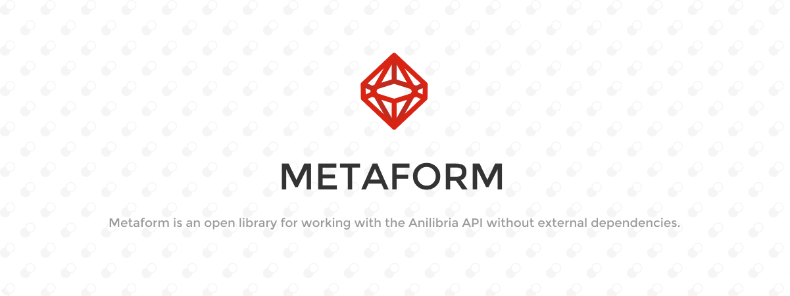

<center>
    
</center>

<br>

<center>
    
    
    
    
    
    
    
    
</center>

<br>

## Structure of the metaform

### Core

Core - a set of entities for building URLs to API endpoints, queries and data parsing you do yourself

### Modules

Modules - is a set of classes that implements the API methods, including requesting and processing data. The names of the methods do not correspond to the original API methods. To work in the NodeJS environment you will need to use cross-fetch or its equivalent.

## 📦 Installation

```shell
$ npm install @maxqwars/metaform
```

```shell
$ yarn add @maxqwars/metaform
```

## Examples of use

### Getting release data using the MetaDatabase module

```typescript
import { Modules, Constants } from '@maxqwars/metaform';

const id = 0; // release id

const database = new Modules.MetaDatabase({
  host: 'api.anilibria.tv',
  version: Constants.API_VER.V2,
  // timeout: default 6000ms
  // useHttps: default `true`
});

database
  .get({ id })
  .then(release => console.log(release))
  .catch(e => console.error(e));
```

### Getting release data using Core modules

```typescript
import { Constants, Core } from '@maxqwars/metaform';

const id = 0; // release id

const urlBuilder = new Core.UrlBuilder({
  host: 'api.anilibria.tv',
  useHttps: true,
});
const queryBuilder = new Core.GetTitleQueryBuilder();

queryBuilder.setId(id);

const reqUrl = urlBuilder
  .setMethod(Constants.API_METHOD.GET_TITLE)
  .setQuery(queryBuilder.build())
  .build();

// Retrieve data in any convenient way using the collected Url
```

## License

MetaForm is an open source library licensed under the MIT license.
