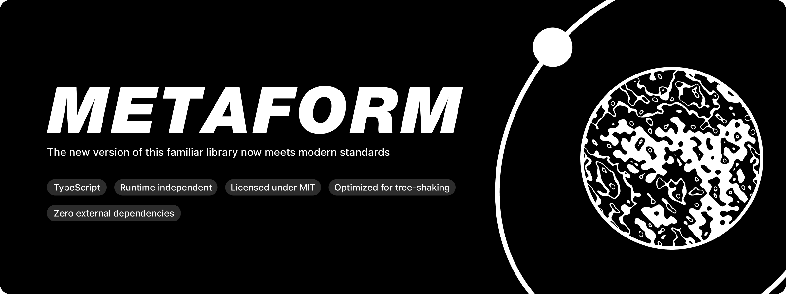

# Что такое Metaform?

Metaform — это легковесная, платформанезависимая TypeScript-библиотека с открытым исходным кодом, предназначенная для гибкого и типизированного взаимодействия с AniLiberty Web API.


Версия **2.0** — это полное переосмысление архитектуры библиотеки с упором на производительность, модульность и строгую типизацию:

- **Функциональная архитектура & Tree-shaking:** Мы полностью ушли от монолитного класса, реализующего все методы API. Теперь каждый эндпоинт — это независимая функция. Если вы используете только 2 метода из 20, остальные не попадут в ваш финальный бандл.
- **Агностицизм к среде выполнения (Zero-dependency Transport):** Из ядра библиотеки полностью удален встроенный `fetch`. Взаимодействие с сетью теперь абстрагировано через интерфейс `Transport`. Вы можете использовать стандартный `fetch`, `axios` или даже читать данные из локального кэша — достаточно реализовать простой интерфейс.
- **Type-Guards и декларативная проверка:** Обновленная система типов в сочетании со строгими защитниками типов (Type Guards) гарантирует валидность данных еще до того, как они попадут в бизнес-логику вашего приложения.

# Быстрый старт

Пример использования независимых функций и встроенного fetch-транспорта для получения списка команд:

```typescript
import { createFetchTransport } from '@maxqwars/metaform/transport/fetch-transport'
import { getTeams } from '@maxqwars/metaform/get-teams'

async function main() {
  // Инициализируем транспорт, указав базовый URL API
  const transport = createFetchTransport(
    '[https://aniliberty.top/api/v1](https://aniliberty.top/api/v1)',
  )

  // Вызываем изолированную функцию запроса, передавая ей транспорт
  const teams = await getTeams(transport, 'v1', {
    include: ['id', 'title'],
  })

  console.log(teams)
}

main().catch(console.error)
```

# Преймущества новой архитектуры

### 1. Кастомные транспорты без модификации исходного кода

Благодаря разделению логики подготовки запроса и его непосредственного выполнения, вы получаете полный контроль над сетевым слоем. Тоесть можно:

- Хотите использовать Axios? Напишите обертку `Transport` с ним.
- Пишите тесты? Передайте тестовый мок транспорт, данные берите хоть с файловой системы хоть пишите прямо в тестовом транспорте.
- Да хоть встраивайте библиотеку в другое приложение где есть поддержка среды JavaScript
- Вы не ограничены, библиотека ждет только того что вы отправите данные в корректном формате.

### 2. Максимальная оптимизация бандла

Ранее архитектура Metaform представляла собой один большой класс, реализующий методы API. Теперь же она состоит из обширного набора гибко настраиваемых функций, которые беспрепятственно взаимодействуют с механизмами «tree-shaking» современных сборщиков.

### 3. Гарантия типов на стыке границ данных

Новая система типов построена по принципу "строгой проверки". Сочетание декларативного маппинга и Type Guards позволяет отловить несоответствие структуры ответов от вашего API на этапе компиляции или на входе в транспорт, защищая ваше приложение от undefined в рантайме.

# Лицензия

Metaform распространяется под лицензией MIT. Вы можете свободно использовать её в любых проектах.
